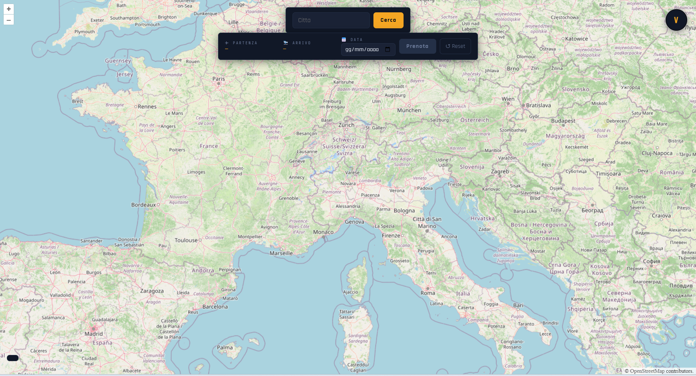

# ✈ AeroPorto — Java EE Airport Management System

AeroPorto is a full-stack Java EE web application that simulates flight booking and airport management using real-world geographic data.

Users can explore airports on an interactive map, save favorite locations, and simulate flight bookings between destinations.

The application follows the MVC architecture, separating presentation (JSP), business logic (Servlets), and persistence (MySQL).

---

## 📸 Preview

> Add screenshots in an `/images` folder

- Login Page  


- Interactive Map  


- Booking System  


- Favorites Page  


---

## 🚀 Key Features

- 🔐 Secure user authentication (Email/Password + Google OAuth2)
- 🗺 Interactive airport map using OpenLayers + OpenStreetMap APIs
- ⭐ Save favorite airports and add personal notes
- ✈ Flight booking simulation with departure and arrival selection
- 📧 Automatic email confirmation after booking
- 🔒 Session-based access control for protected pages
- 🔁 Password recovery system with secure token validation

---

## 🧠 Architecture Overview

- MVC pattern (JSP → Servlets → MySQL)
- Layered backend design (Controller / Service / DAO separation)
- Secure session management with authentication filters
- External API integration for geolocation and airport mapping

---

## 🛠 Tech Stack

- Java EE (Servlets, JSP)
- MySQL (Relational database)
- HTML5, CSS3, JavaScript
- OpenLayers (interactive maps)
- OpenStreetMap APIs (Nominatim, Overpass)
- Google OAuth2 authentication
- BCrypt password hashing

---

## 🔐 Security Features

- Passwords hashed using BCrypt
- OAuth2 authentication via Google Identity Services
- Session filtering for protected resources
- Secure token-based password reset system

---

## ⚙️ How to Run

1. Clone the repository:
   ```bash
   git clone https://github.com//Aale-Hussain/airport-management-system.git
